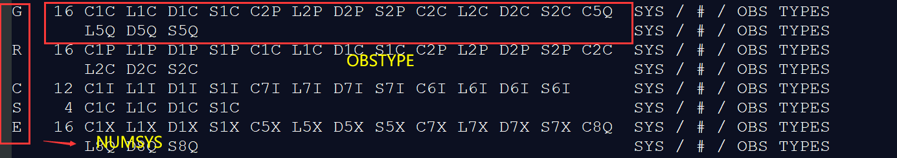

# set_index解析

## 1. 储备知识

> 1. rtklib 2.4.3版本依据的是**rinex 3.04**观测类型的定义

> 2. tobs介绍

```
//这是一个用来存储obs头文件中“# / TYPES OF OBSERV”信息的三维数组

char tobs[NUMSYS][MAXOBSTYPE][4]={{""}}; //from readrnxfp.c
//以下图为例，tobs[0]表示存储的GPS所有观测类型，tobs[0][1]表示L1C
```



> 3. sigind_t是set_index的作用对象，通过set_index()对sigind_t赋值，一个卫星系统对于一个结构体sigind_t

```c
/* type definition -----------------------------------------------------------*/
typedef struct {                        /* signal index type */
    int n;                              /* number of index */
    int idx[MAXOBSTYPE];                /* signal freq-index*/
    int pos[MAXOBSTYPE];                /* signal index in obs data (-1:no) */
    unsigned char pri [MAXOBSTYPE];     /* signal priority (15-0) */
    unsigned char type[MAXOBSTYPE];     /* type (0:C,1:L,2:D,3:S) */
    unsigned char code[MAXOBSTYPE];     /* obs code (CODE_L??) */
    double shift[MAXOBSTYPE];           /* phase shift (cycle) */
} sigind_t;
```

> set_index主体部分

```c
//此处循环观测值的数量
    for (i=n=0;*tobs[i];i++,n++) {
        ind->code[i]=obs2code(tobs[i]+1,ind->frq+i);
        ind->type[i]=(p=strchr(obscodes,tobs[i][0]))?(int)(p-obscodes):0;
        ind->pri[i]=getcodepri(sys,ind->code[i],opt);
        ind->pos[i]=-1;
    }
```

## 2. obs2code(sigind_t->code)

**输入**：obs 是上面的OBSTYPE的后两位

**函数作用**：根据观测类型后两位查找其在自定义的obscodes[]中的索引

**返回值**：返回的是索引对应的**CODE_L??**(在rtklib.h搜索可得)，CODE_L??顺序和obscodes一致，可以看作返回obscodes索引，函数的返回值存入sigind_t->[i]

```c
//obscodes是rtklib作者自定义，可修改
static char* obscodes[] = {       /* observation code strings */

	""  ,"1C","1P","1W","1Y", "1M","1N","1S","1L","1E", /*  0- 9 */
	"1A","1B","1X","1Z","2C", "2D","2S","2L","2X","2P", /* 10-19 */
	"2W","2Y","2M","2N","5I", "5Q","5X","7I","7Q","7X", /* 20-29 */
	"6A","6B","6C","6X","6Z", "6S","6L","8L","8Q","8X", /* 30-39 */
	"2I","2Q","6I","6Q","3I", "3Q","3X","1I","1Q","5A", /* 40-49 */
	"5B","5C","9A","9B","9C", "9X","1D","5D","5P","5Z", /* 50-59 */
	"6E","7D","7P","7Z","8D", "8P","4A","4B","4X",""    /* 60-69 */
};
```

```c
/* obs type string to obs code -------------------------------------------------
* convert obs code type string to obs code
* args   : char   *str      I   obs code string ("1C","1P","1Y",...)
* return : obs code (CODE_???)
* notes  : obs codes are based on RINEX 3.04
*-----------------------------------------------------------------------------*/
extern uint8_t obs2code(const char* obs)
{
	int i;

	for (i = 1; *obscodes[i]; i++) {
		if (strcmp(obscodes[i], obs)) continue;
		return (uint8_t)i;
	}
	return CODE_NONE;
}
```

## 3. sigind_t->type

ind->type[i]存储观测类型第一位查找其在obscodes[]的索引值，0:C,1:L,2:D,3:S（返回的是观测的类型）

```c
static const char obscodes[]="CLDS";    /* obs type codes */
ind->type[i]=(p=strchr(obscodes,tobs[i][0]))?(int)(p-obscodes):0;
```

## 4.code2idx(sigind_t->idx)

**输入**：输入卫星系统标识和sigind_t结构体中的卫星编码(即观测类型的后两位)

**函数作用**：将观测类型的频率索引(0~4见下表)存入对应**sigind_t->idx**

**输出**：返回该观测类型的频率索引(即下面表格里的0-4)

* 对于**GLONASS卫星**RTKLIB里设置**fcn=0**，rinex文件里fcn有数字选项

| 频率/MHz  |             0              |         1         |      2       |      3      |         4         |
| :-------: | :------------------------: | :---------------: | :----------: | :---------: | :---------------: |
|    GPS    |        L1(1575.42)         |    L2(1227.60)    | L5(1176.45)  |  -(表示无)  |         -         |
| BDS(3.02) |        B1(1561.098)        |    B2(1207.14)    |      -       | B3(1268.52) |         -         |
| BDS(3.04) | B1C(1575.42)/B1I(1561.098) |   B2b(1207.14)    | B2a(1176.45) | B3(1268.52) | B2a+B2b(1191.795) |
|  GLONASS  |     G1(1602+fcn*9/16)      | G2(1246+fcn*7/16) | G3(1202.025) |             |                   |
|  Galileo  |        E1(1575.42)         |   E5b(1207.14)    | E5a(1176.45) | E6(1278.75) | E5a+E5b(1191.795) |
|   SBAS    |        L1(1575.42)         |    L5(1176.45)    |      -       |      -      |         -         |
|   QZSS    |                            |                   |              |             |                   |

```c
extern int code2idx(int sys, uint8_t code)
{
	double freq;

	switch (sys) {
	case SYS_GPS: return code2freq_GPS(code, &freq);
	case SYS_GLO: return code2freq_GLO(code, 0, &freq);
	case SYS_GAL: return code2freq_GAL(code, &freq);
	case SYS_QZS: return code2freq_QZS(code, &freq);
	case SYS_SBS: return code2freq_SBS(code, &freq);
	case SYS_CMP: return code2freq_BDS(code, &freq);
	}
	return -1;
}
```

## 5. getcodepri

//此处是确定通道的优先级，15:highest-1:lowest,0:error

```c
static char codepris[7][MAXFREQ][16] = {  /* code priority for each freq-index */
   /*    0         1          2          3         4         5     */
	{"CPYWMNSL","PYWCMNDLSX","IQX"     ,""       ,""       ,""      ,""}, /* GPS */
	{"CPABX"   ,"PCABX"     ,"IQX"     ,""       ,""       ,""      ,""}, /* GLO */
	{"CABXZ"   ,"IQX"       ,"IQX"     ,"ABCXZ"  ,"IQX"    ,""      ,""}, /* GAL */
	{"CLSXZ"   ,"LSX"       ,"IQXDPZ"  ,"LSXEZ"  ,""       ,""      ,""}, /* QZS */
	{"C"       ,"IQX"       ,""        ,""       ,""       ,""      ,""}, /* SBS */
	{"IQXDPAN" ,"IQXDPZ"    ,"DPX"     ,"IQXA"   ,"DPX"    ,""      ,""}, /* BDS */
	{"ABCX"    ,"ABCX"      ,""        ,""       ,""       ,""      ,""}  /* IRN */
};
```

```c
/* get code priority -----------------------------------------------------------
* get code priority for multiple codes in a frequency
* args   : int    sys     I     system (SYS_???)
*          unsigned char code I obs code (CODE_???)
*          char   *opt    I     code options (NULL:no option)
* return : priority (15:highest-1:lowest,0:error)
*-----------------------------------------------------------------------------*/
extern int getcodepri(int sys, unsigned char code, const char *opt)
{
	const char *p, *optstr;
	char *obs, str[8] = "";
	int i, j;

	switch (sys) {
	case SYS_GPS: i = 0; optstr = "-GL%2s"; break;
	case SYS_GLO: i = 1; optstr = "-RL%2s"; break;
	case SYS_GAL: i = 2; optstr = "-EL%2s"; break;
	case SYS_QZS: i = 3; optstr = "-JL%2s"; break;
	case SYS_SBS: i = 4; optstr = "-SL%2s"; break;
	case SYS_CMP: i = 5; optstr = "-CL%2s"; break;
	default: return 0;
	}
	obs = code2obs(code, &j);	//j:frequency (1:L1,2:L2,3:L5,4:L6,5:L7,6:L8,0:err)
								//obs:obs code string ("1C","1P","1P",...)

	/* parse(分析) code options */
	for (p = opt; p && (p = strchr(p, '-')); p++) {	//每次迭代后更新p为下一个连字符'-'的位置
		if (sscanf(p, optstr, str)<1 || str[0] != obs[0]) continue;	//str存储从字符串p中按optstr格式化提取的数据
		return str[1] == obs[1] ? 15 : 0;
	}
	/* search code priority */
	//此处是确定通道的优先级，15:highest-1:lowest,0:error
	return (p = strchr(codepris[i][j - 1], obs[1])) ? 14 - (int)(p - codepris[i][j - 1]) : 0;
}
```


