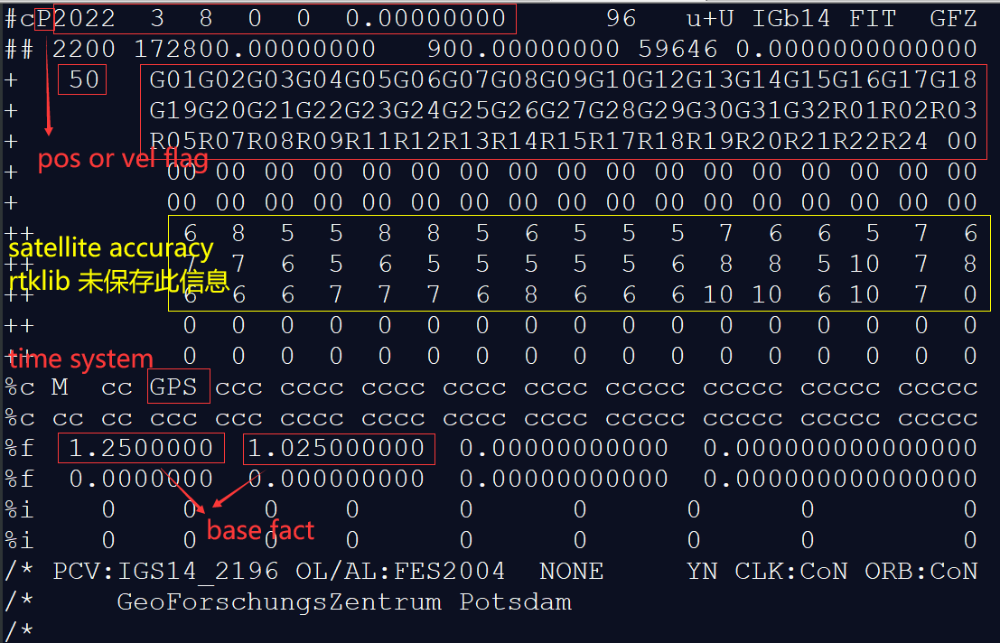
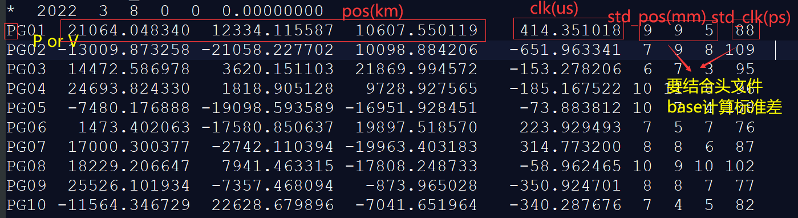
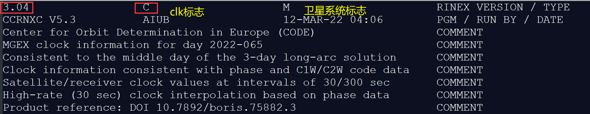
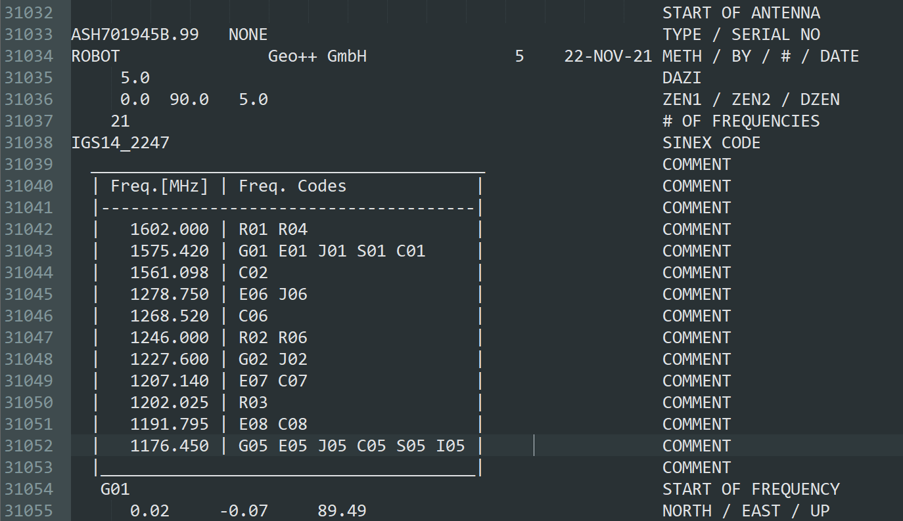
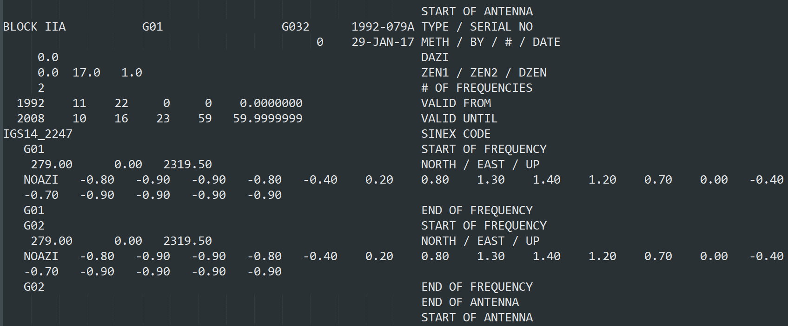
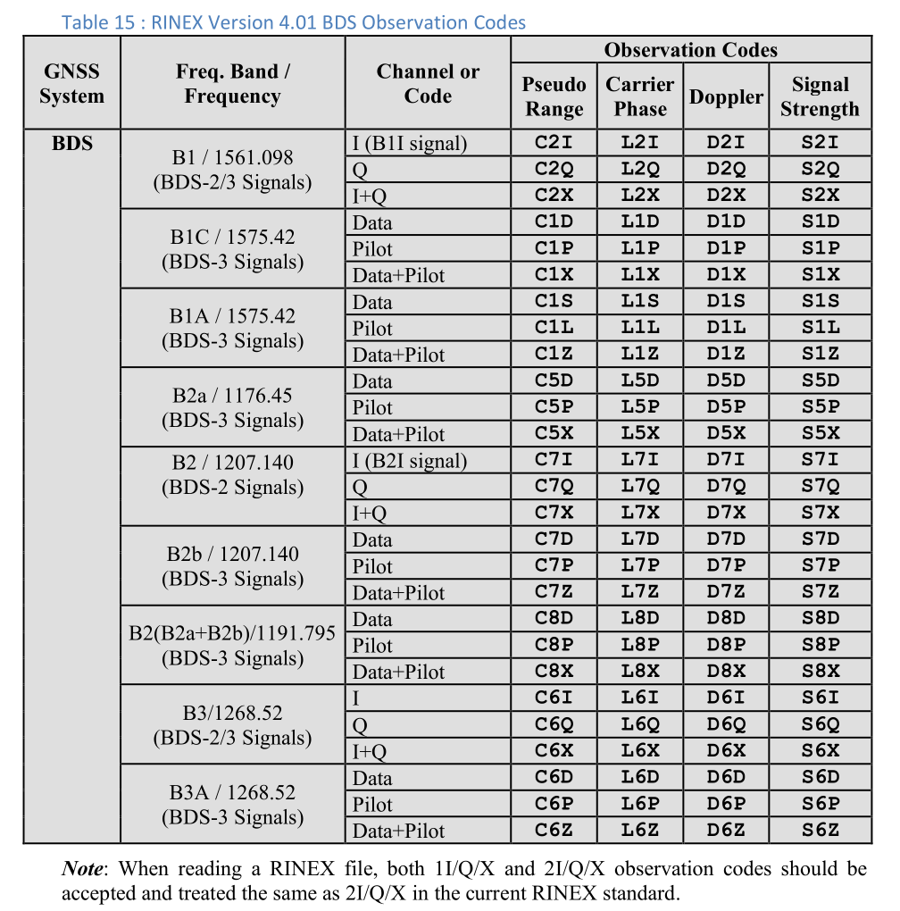
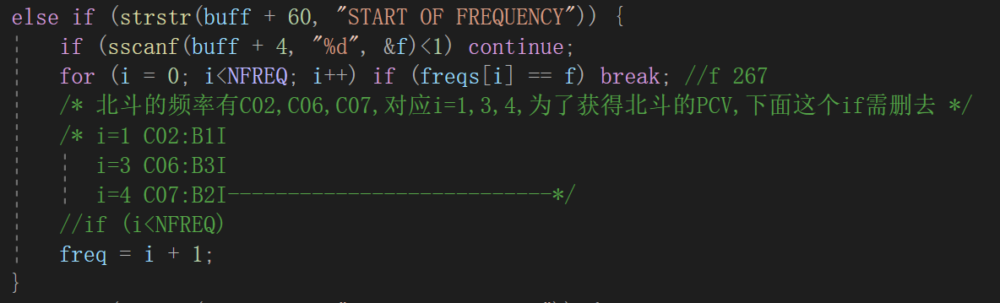
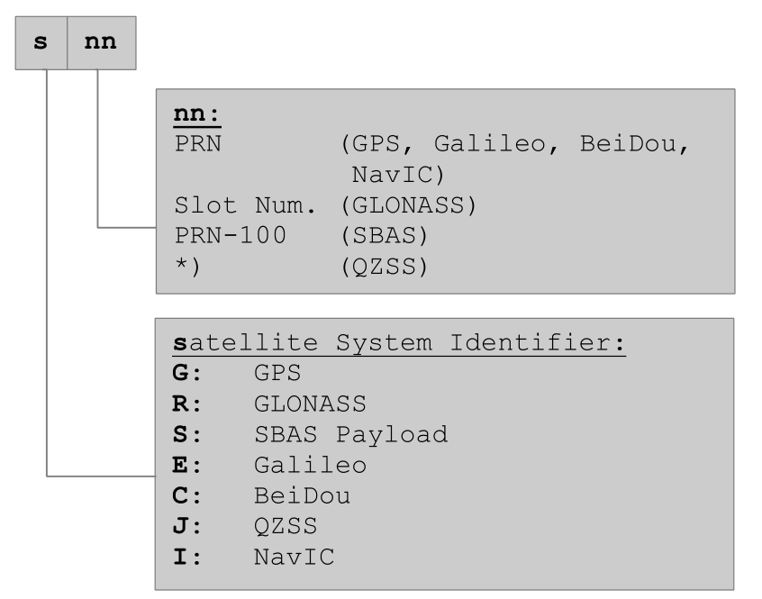
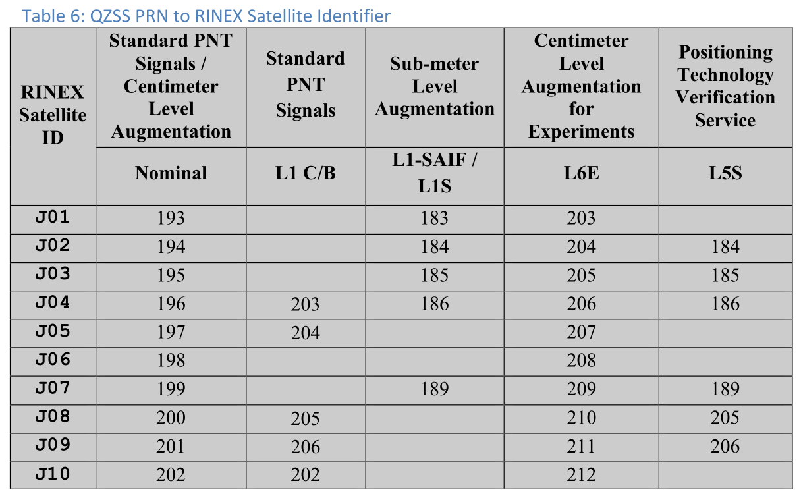

# day02_文件读取

文件格式参考网站:(igs data format)[[Index of /pub/data/format (igs.org)](https://files.igs.org/pub/data/format/?_ga=2.219585243.319817931.1678535317-688533390.1678446187&_gl=1*1dnju1n*_ga*Njg4NTMzMzkwLjE2Nzg0NDYxODc.*_ga_Z5RH7R682C*MTY3ODUzOTUwMC40LjEuMTY3ODUzOTU5My41Ny4wLjA.)]

## 1 观测值文件(obs)

### 1.1 obs文件头

1. 读入结构体的信息参考rinex 3.02 Observation Header 处注释

2. 重点是把文件头"**SYS / # / OBS TYPES**"处信息存入**char tobs[i] [MAXOBSTYPE] [4]**中 (说明：i表示卫星系统，[MAXOBSTYPE] [4]存储一个观测值类型+‘\0’)

3. 主要存储到**sta_t**结构体

### 1.2 obs文件体

1. obsd_t存储一个历元中一颗卫星的观测值，obs_t存储观测文件的所有观测值，即总观测卫星数个的obsd_t结构体
1. tobs和set_index参考[set_index解析]()

### 其他

动态接收机:文件头marker type 必须有，文件体event flag:2(start moving antenna)也必须有

LLI失锁标志还得再研究研究


**TGD 和DCB 误差**

[GNSS TGD /DCB改正模型]([GNSS TGD/DCB改正模型_小李爱睡觉_的博客-CSDN博客](https://blog.csdn.net/weixin_44021189/article/details/128736089))

## 2 广播星历(n)

reference:[RINEX3广播星历中的toc，toe，IODE 及时间规化](https://blog.csdn.net/qq_35099602/article/details/108235804)

1. 读取GPS，BDS，Galileo的广播星历函数为**readrnxnavb**，一颗卫星轨道数据存储的结构体是**eph_t**
2. 广播星历所有卫星数据存入**nav_t->eph_t**下
3. question:这个ura_eph和卫星星历里的SV accuracy有什么关系

```c
static const double ura_eph[]={         /* ura values (ref [3] 20.3.3.3.1.1) */
    2.4,3.4,4.85,6.85,9.65,13.65,24.0,48.0,96.0,192.0,384.0,768.0,1536.0,
    3072.0,6144.0,0.0
};
```


----

## 3 精密星历(sp3)

* 目前有两种版本sp3-c(2010年)和sp3-d(2016年)
* 时间间隔一般为15min

### 3.1 存储结构体

***nav_t->peph_t***存储精密星历一个历元数据，***nav_t->ne***存储历元数量，

```c
typedef struct {        /* precise ephemeris type */
    gtime_t time;       /* time (GPST) */
    int index;          /* ephemeris index for multiple files */
    double pos[MAXSAT][4]; /* satellite position/clock (ecef) (m|s) */
    float  std[MAXSAT][4]; /* satellite position/clock std (m|s) */
    double vel[MAXSAT][4]; /* satellite velocity/clk-rate (m/s|s/s) */
    float  vst[MAXSAT][4]; /* satellite velocity/clk-rate std (m/s|s/s) */
    float  cov[MAXSAT][3]; /* satellite position covariance (m^2) */
    float  vco[MAXSAT][3]; /* satellite velocity covariance (m^2) */
} peph_t;
```

### 3.2 读取函数

***preceph.c->readsp3()函数***

### 3.3 sp3c文件头

**sp3文件头读取注意事项（参考sp3c说明书）**

1. sp3文件一般是卫星位置文件(pos flag)，本文未对vel文件格式进行研究。以下给的例子是pos文件

2. 文件头第一行右边四列分别表示***the data used descriptor***、***the coordinate system used descriptor***、***the orbit type descriptor***、***the agency descriptor***，其具体含义可查看sp3c说明文档

3. 在sp3里面，对于***QZSS***系统，***nn=PRN-192***(例：***QZS-1(PRN=193)***在sp3里是***J01***)；对于***SBAS***系统，***nn=prn-100***，类似[atx规定](###1 缩略词)

4. ***satellite accuracy***表示的是指数(以第一个数字**6**为例，其表示*G01*精度为$2^6mm$)，但是这种获得的标准差**不如**用下面的***base fact***所得，所以***RTKLIB并没有***对此段进行读取
5. 第一个*base fact* 1.25表示位置pos标准差的指数中的底数，第一个*base fact* 1.025表示钟差clk标准差的指数中的底数(详[sp3c文件体](###2.4 sp3c文件体))



### 3.4 sp3c文件体

**sp3文件体读取注意事项（参考sp3c说明书）**

1. 第一列一般为***'P'***，但也可能为***'V'***、***'EP'***、***'EV'***；除下图记录，可能在第76和80列出现标志***'P'***表示轨道和钟差误差为预测，具体可参考sp3说明文档
2. 标准差计算：$std(pos_x)=1.25^9 mm$，$std(clk)=1.025^{88} psec$，注意单位转换（如图）
3. 精密星历卫星位置是以**质心*(center of mass)***为中心，而实际卫星发射信号以**天线相位中心*(antenna phase center position)***为中心，RTKLIB里调用preceph.c->satantoff()函数改正到天线相位中心，参考(天线COM->APC)[]
4. 对于*pos*观测值，*** bad or absent***被设为**0.000000**；对于*clk*观测值，***bad or absent***被设为**999999.999999**；对于*std(pos)*，***bad***被设为***99 or 999***，***absent***表示标准差未知



---

## 4 精密钟差(clk)

* clk文件时间间隔一般为***30s***
* clk文件3.04版本于2017年发布，而RTKLIB读取的针对3.04版本以前，故**源代码需修改**

### 4.1 存储结构体

```c
typedef struct {        /* precise clock type */
    gtime_t time;       /* time (GPST) */
    int index;          /* clock index for multiple files */
    double clk[MAXSAT][1]; /* satellite clock (s) */
    float  std[MAXSAT][1]; /* satellite clock std (s) */
} pclk_t;
```

### 4.2 读取函数

进入函数：***rinex.c->readrnxc()函数***；读取主函数：***rinex.c->readrnxclk()函数***

### 4.3 clk文件头



### 4.4 clk文件体

* 存储的值有两个：钟差(clock bias)和Clock bias sigma[optional]


------


## 4 天线文件(atx)

### 4.1 参考链接

> [igs 14 introduction]([files.igs.org/pub/data/format/antex14.txt](https://files.igs.org/pub/data/format/antex14.txt))
>
> [antenna calibration introduction](https://www.ngs.noaa.gov/ANTCAL/FAQ.xhtml#faq4)

### 4.2 前置知识

天线相位影响精度在cm级

**名词解释**

```
ARP：antenna reference point
PCO:phase center offset（和频率有关）
PCV：phase center variations（和频率有关）
```

**接收机天线相位改正部分(.atx)**



**卫星天线相位改正部分(.atx)**



对于我的数据文件igs20_2303.atx从第18194行开始是北斗卫星天线相位改正

对于频点，其只记录了C02/C06/C07

E01 开始行数：4794

接收机天线相位中心开始行数：21084



在atx文件中，

```c
//下面的i代表其在freqs里的索引
freqs[] = { 1,2,5,6,7,8,0 };
```


|   卫星系统    |   0    |          1           |          4           |             |          3          |
| :-----------: | :----: | :------------------: | :------------------: | ----------- | :-----------------: |
|      GPS      | L1:G01 |        L2:G02        |        L5:G05        |             |                     |
| Galileo(4794) | E1:E01 |       E5a:E05        |       E5b:E07        | E5a+E5b:E08 |       E6:E06        |
| BeiDou(18215) | E1:C01 | E2:C02(B1I:1561.098) | E5b:C07(B2I:1207.14) | -           | E6:C06(B3I:1268.52) |
| GLONASS(2405) |        |                      |                      |             |                     |
|               |        |                      |                      |             |                     |



### 4.4 问题

1. **question:难道pcvs->pcv定义的是指向结构体数组的指针?那么realloc函数在分配空间时难道有创建结构体数组的功能？**

```c
typedef struct {        /* antenna parameter type */
    int sat;            /* satellite number (0:receiver) */
    char type[MAXANT];  /* antenna type */
    char code[MAXANT];  /* serial number or satellite code */
    gtime_t ts,te;      /* valid time start and end */
    double off[NFREQ][ 3]; /* phase center offset e/n/u or x/y/z (m) */
    double var[NFREQ][19]; /* phase center variation (m) */
                        /* el=90,85,...,0 or nadir=0,1,2,3,... (deg) */
} pcv_t;

typedef struct {        /* antenna parameters type */
    int n,nmax;         /* number of data/allocated */
    pcv_t *pcv;         /* antenna parameters data */
} pcvs_t;

/* add antenna parameter -----------------------------------------------------*/
static void addpcv(const pcv_t *pcv, pcvs_t *pcvs)
{
    pcv_t *pcvs_pcv;
    
    if (pcvs->nmax<=pcvs->n) {
        pcvs->nmax+=256;
        if (!(pcvs_pcv=(pcv_t *)realloc(pcvs->pcv,sizeof(pcv_t)*pcvs->nmax))) {
            trace(1,"addpcv: memory allocation error\n");
            free(pcvs->pcv); pcvs->pcv=NULL; pcvs->n=pcvs->nmax=0;
            return;
        }
        pcvs->pcv=pcvs_pcv;
    }
    pcvs->pcv[pcvs->n++]=*pcv;	//question:难道pcvs->pcv定义的是指向结构体数组的指针
}
```

2. 时间转换函数还需要阅读


## 5 码偏差(DCB)

在PPP计算时使用IF组合，使用的伪距观测值代码分别为：

```
GPS：C1W C2W
BDS：C2I C6I
GAL：C1C C5Q
QZS：C1C C5X
DCB文件包含下述改正：
BDS-2 —— C2I-C7I, C2I-C6I                                                    
BDS-3 —— C1X-C5X, C1P-C5P, C1D-C5D  
```

C2I和C6I在BD2和BD3里面都存在，C7I只在BD2存在

| 频率     | BDS  | 频率    | atx里面频率代号 |
| -------- | ---- | ------- | --------------- |
| 1561.098 | C2I  | 1575.42 | C02——E2         |
| 1268.52  | C6I  | 1278.75 | C06——E6         |
| 1207.14  | C7I  | 1207.14 | C07——E5b        |


## 6 地球自传参数文件(erp)

主要包括地球极点的位移Xpole Ypole和速率Xrt Yrt，UT1-UTC时间差，由天文观测确定的一天的时间长度与 86400 秒之间的差值 LOD，这里的单位很小，需要注意转换。

readerp()这个函数还未阅读，后面记得查看

## 5 杂记

### 5.1 方差等于标准差的平方

```c
 *vare=SQR(std);	//variance=squre(standard);
```

查查N文件IODE、TOE代表什么


## 卫星系统标识[^卫星系统参考链接]

### 1 缩略词

**卫星标识**包括系统标识、SVN号、COSPAR-ID号、PRN四类：

1. **GNSS系统标识**：不同卫星导航系统的标识
   ——C:BDS
   ——G:GPS
   ——R:GLONASS
   ——E:GLONASS
2. **SVN**号：（Space Vehicle Number）空间飞行器编号，表示导航卫星的唯一编号
3. **COSPAR-ID**：（Committee on space research-ID）国际卫星标识符，用于命名、标识人造卫星，由两排数字与一排字母组成。第一排数字为该卫星的发射年，第二排数字为该卫星在其发射年的全球发射顺序，跟在第二排数字右侧的字母是在该次发射任务中分离出多个部分时用于标识每一部分;
4. **PRN号**：利用伪随机码标识导航卫星的编号

一般sNNN标识SVN号，sNN标识prn号

* 对于不同卫星系统，sNN一般从s01开始，常见的是我们说的prn号(不同卫星系统叫法不同)

——**GPS、BD**：the PRN number

——**GLONASS**：the Slot number

——**Galileo**：the SVID number

——**SBAS**：PRN number minus 100

——**QZSS**：见下表（很奇怪，待后面理解再补充）





* sNNN一般表示SVN号

——GPS：SVN number

——GLONASS：GLONASS number

——Galileo：GSAT number

——QZSS：SVN number（183-202）

——SBAS：120-158

* 在RTKLIB中各卫星系统sNN及其number如下
* **注意**：下面number是在各卫星系统都预定义了的前提下，如果缺少某个卫星系统其number会减去对应卫星系统卫星数量

| 卫星系统 |        sNN        | number  |
| :------: | :---------------: | :-----: |
|   GPS    |  G01-G32**(32)**  |  1-32   |
| GLONASS  |  R01-R27**(27)**  |  33-59  |
| Galileo  |  E01-E36**(36)**  |  60-95  |
|   QZSS   | J193-J202**(10)** | 96-105  |
|   BDS    |  C01-C63**(63)**  | 106-168 |
|  IRNSS   |  I01-I14**(14)**  | 169-182 |
|   LEO    |  L01-L10**(10)**  | 183-192 |
|   SBAS   |  S20-S58**(39)**  | 193-231 |

```
/* 05/20/2024 add bu mu  */
    char obs    [MAXSTRPATH];
    char nav    [MAXSTRPATH];
    char sp3    [MAXSTRPATH];
    char clk    [MAXSTRPATH];
```


[^卫星系统参考链接]:[System Introduction (csno-tarc.cn)](http://www.csno-tarc.cn/en/system/introduction)
