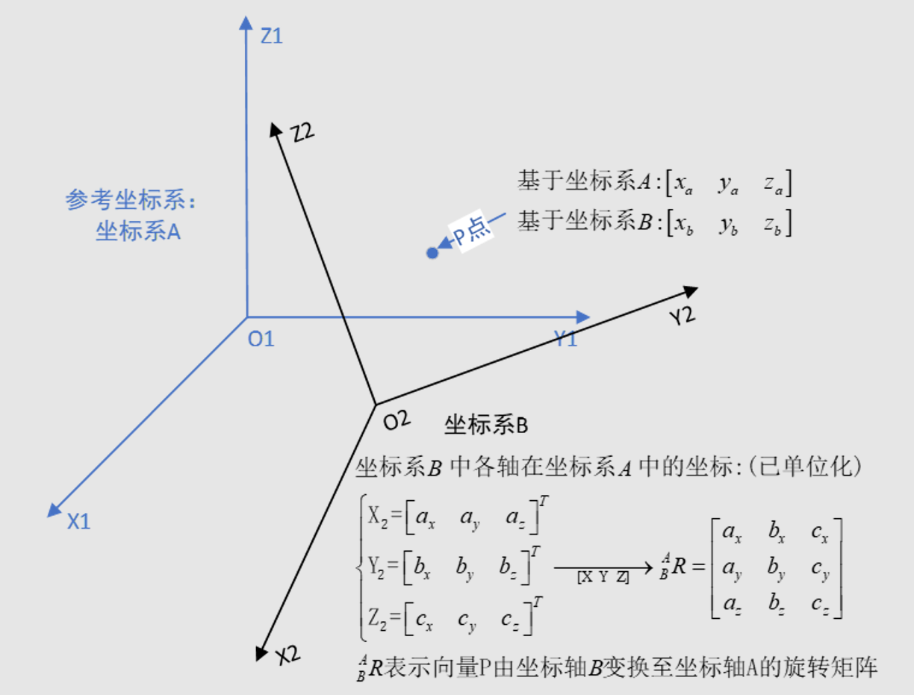
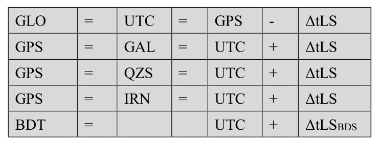

# 坐标和时间转换

这节待完成老师任务后补充

## 1 坐标转换

### 1.1坐标系介绍

#### ECI(地心惯性坐标系)

### 2.1 三维坐标转换

验证旋转矩阵
$$
假设O_2Z_2向量在B坐标系中为\left[\begin{matrix}1 & 0 & 0\end{matrix}\right]^T	\\
_B^AR\times \left[\begin{matrix}1 \\ 0 \\ 0\end{matrix}\right]=
\left[\begin{matrix}a_x \\ a_y \\ a_z \end{matrix}\right]	\\
\left[\begin{matrix}a_x & a_y & a_z \end{matrix}\right]^T为O_2Z_2向量在A坐标中的向量	\\
\therefore 正确
$$

$$
从B到A的转换：_B^AR=
\left[
\begin{matrix}
a_x & b_x & c_x	\\
a_y & b_y & c_y	\\
a_z & b_z & c_z
\end{matrix}
\right]	\\

从A到B的转换：^B_AR=(^A_BR)^{-1}=(^A_BR)^T=
\left[
\begin{matrix}
a_x & a_y & a_z	\\
b_x & b_y & b_z	\\
c_x & c_y & c_z
\end{matrix}
\right]	\\
R^B_A，R_B^A都是单位正交矩阵，因此R^T=R^{-1}	\\
$$

### 2.2 ecef2pos

注意：RTKLIB中ecef2pos(rtkcmn.c)这个函数存在问题，ECEF坐标系下(0,0,0)转为大地坐标系大地高应该为WGS84椭球的短半长轴(6356752.3142451795)，但是该代码获得的是长半长轴(6378137)，注意进行修正

## 2 时间转换

Gregorian date(公历)

### 2.1 时间系统

各大卫星系统时定义可参考[RINEX_4.01-->chapter 4.1]()

#### 不同卫星时间系统关系

#### 周跳

