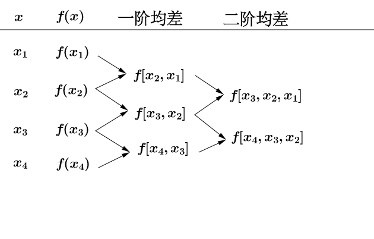
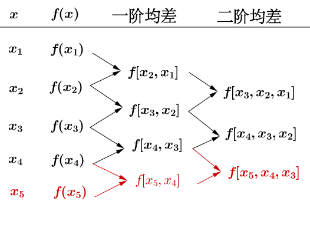

# 算法模型

## 1.插值算法

**插值**：通俗说，已知*n*个点*x1,x2,...,xn*的函数值，使用插值函数求出一个n次多项式插值函数*f(x)*,*f(x)*是接近未知原函数*p(x)*的函数

### 1.1 lagrange插值

reference:[拉格朗日多项式插值法](https://blog.csdn.net/weixin_47210960/article/details/119428254)和[直观地理解拉格朗日插值法](https://www.zhihu.com/question/58333118)

#### 公式

以*n=3*为例，求3次多项式插值函数
$$
f(x)=y_1f_1(x)+y_2f_2(x)+y_3f_3(x)	&
\text{其中}:
f_i(x_j)=
\begin{cases}
1 & i=j	\\
0 & i\neq j
\end{cases}	\\
\\
\text{推测：}f_1(x)=\frac{(x-x_2)(x-x_3)}{(x_1-x_2)(x_1-x_3)} &
f_2(x)=\frac{(x-x_1)(x-x_3)}{(x_2-x_1)(x_2-x_3)} & f_3(x)=\frac{(x-x_1)(x-x_2)}{(x_3-x_1)(x_3-x_2)}
$$
推广到*n*阶多项式
$$
f(x)=\sum_{i=1}^{n}y_if_i(x)	\\
f_i(x)=\prod_{j\neq i}^{1\leq j\leq n} \frac{(x-x_j)}{(x_i-x_j)}	
$$

#### 代码

待补充

### 1.2 牛顿插值法

全名Gregory-Newton formula，reference:[牛顿插值的几何解释是怎么样的](https://www.zhihu.com/question/22320408/answer/141973314)

牛顿插值法的特点在于：每增加一个点，不会导致之前的重新计算，只需要算和新增点有关的就可以了。

#### 公式

$$
一阶均差：f[x_i,x_j]=\frac{f(x_i)-f(x_j)}{x_i-x_j} & i\neq j	\\
二阶均差:f[x_i,x_j,x_k]=\frac{f[i,j]-g[j,k]}{x_i-x_k} & i\neq j\neq k	\\
\\
\therefore f(x)=f(x_0)+f[x_0,x_1](x-x_0)	\\
+f[x_0,x_1,x_2](x-x_0)(x-x_1)	\\
+f[x_0,x_1,...,x_{n-1},x_n](x-x_0)(x-x_1)...(x-x_{n-2})(x-x_{n-1})
$$

从下面两幅图可以看出，新增节点，我们只需重新计算红色部分，其他可不变





#### 代码

待补充

### 1.3 Neville插值

reference:[数值分析-lagrange和Neville插值](https://zhuanlan.zhihu.com/p/47282502)

#### 联系

这条定理重要含义在于:两个***k-1***阶，有***k-1***个公共插值节点的*Lagrange*插值多项式可以生成一个*k*阶的*Lagrange*插值多项式。因此我们可以采用**递归**的方法来计算高阶*Lagrange*多项式，即可利用先前计算得到的结果，大大减少了计算量
$$
\text{定理：给定}x_0,x_1,...,x_k,x_i\neq x_j,\text{我们用}P_{0,1,...,k}\text{表示由}x_0,...,x_k\text{这些插值节点生成的Lagrange插值多项式}	\\
\therefore  P_{0,1,...,k}(x)=\frac{(x-x_j)P_{0,...,j-1,j+1,...,k}(x)-(x-x_i)P_{0,...,i-1,i+1,...,k}(x)}{x_i-x_j}
$$

#### 公式

*Neville插值公式如下*：令***j=n,i=0***
$$
P_{0,n}(x)=\frac{x-x_0}{x_n-x_0}P_{1,n}(x)-\frac{x-x_n}{x_n-x_0}P_{0,n-1}(x)
$$


#### 代码

```c
/* polynomial interpolation by Neville's algorithm ---------------------------*/
/* 这里x=xn-x,n=插值历元+1*/
static double interppol(const double *x, double *y, int n)
{
    int i,j;
    
    for (j=1;j<n;j++) {
        for (i=0;i<n-j;i++) {
            y[i]=(x[i+j]*y[i]-x[i]*y[i+1])/(x[i+j]-x[i]);
        }
    }
    return y[0];
}
/*用10个历元的精密星历来插值time时刻卫星位置-----------------------------------------*/
for (j=0;j<=NMAX;j++) {
    t[j]=timediff(nav->peph[i+j].time,time);	//t[j]存储(插值历元-卫星信号发送时间)
}

for (i=0;i<3;i++) {
        rs[i]=interppol(t,p[i],NMAX+1);	//Neville插值，这里注意传进的x为(Ts-t)
}
```

### 1.4 线性插值

#### 公式

观察发现，这个式子与*Niville*的二阶插值多项式类似$(P_{i,i+1})$，实际上，经过比较发现，其与*y=kx+b*形式一样
$$
dT^S(t)=\frac{(t_{i+1}-t)dT^S(t_i)+(t-t_i)dT^S(t_{i+1})}{t_{i+1}-t_i}	\\
\text{式中：}dT^S(t)\text{表示}t\text{时刻的卫星钟差}
$$

#### 代码

```c
/* linear interpolation for clock 钟差线性插值------*/
    t[0]=timediff(time,nav->peph[index  ].time);
    t[1]=timediff(time,nav->peph[index+1].time);
    c[0]=nav->peph[index  ].pos[sat-1][3];
    c[1]=nav->peph[index+1].pos[sat-1][3];

 dts[0]=(c[1]*t[0]-c[0]*t[1])/(t[0]-t[1]);	//dts为插值钟差
```

## 2.观测值组合


### *Iono-free*

```c
/* 参考preceph.c->satantoff()函数---------------*/
iono-free LC frequencies defined as follows:
*            GPS/QZSS : L1-L2
*            GLONASS  : G1-G2
*            Galileo  : E1-E5b
*            BDS      : B1I-B2I
*            NavIC    : L5-S
```

$$
\left\{
\begin{aligned}
P_{IF}^i&=\frac{f_{1}^{2}}{f_{1}^{2}-f_{2}^{2}}P_{1}-\frac{f_{2}^{2}}{f_{1}^{2}-f_{2}^{2}}P_{2}\\
&=\rho^i+cdt_r-cdT^i+m^i\cdot ztd+\varepsilon(P_{IF}^i)\\
\lambda_{IF}\Phi_{IF}^i&=\frac{f_{1}^{2}}{f_{1}^{2}-f_{2}^{2}}\Phi_{1}-\frac{f_{1}f_{2}}{f_{1}^{2}-f_{2}^{2}}\Phi_{2}\\
&=\rho^i+cdt_r-cdT^i+m^i\cdot ztd-\lambda_{IF}N_{IF}^{i}+\varepsilon(\Phi_{IF}^i)
\end{aligned}
\right.
$$

$$
\underset{\substack{2 \times m}}{\mathbf{v}}=
\begin{bmatrix}
v_P	\\
v_\Phi
\end{bmatrix}
=
\begin{bmatrix}
v_P^1 & v_P^2 & \cdots & v_P^m	\\
v_\Phi^1 & v_\Phi^2 & \cdots & v_\Phi^m
\end{bmatrix}^T
$$


$$
X=[x \quad y \quad z \quad dt_r \quad ztd \quad \widetilde{N}_{IF}^1 \quad \widetilde{N}_{IF}^2 \quad ... \quad \widetilde{N}_{IF}^m]
$$

$$
\underset{\substack{2m \times (m+5)}}{\mathbf{B}}=
\begin{bmatrix}
a_{Px_1} & a_{Py_1} & a_{Pz_1} & 1 & m_1 & 0 & \cdots & 0	\\
\vdots  & \vdots  & \vdots  &  \vdots  & \vdots  & \vdots  & \vdots  & \vdots  & \\
a_{Px_m} & a_{Py_2} & a_{Pz_2} & 1 & m_m & 0 & \cdots & 0	\\
a_{\Phi x_1} & a_{\Phi y_1} & a_{\Phi z_1} & 1 & m_{m+1} & 1 & \cdots & 0	\\
\vdots  & \vdots  & \vdots  &  \vdots  & \vdots  & \vdots  & \vdots  & \vdots  & \\
a_{\Phi x_m} & a_{\Phi y_m} & a_{\Phi z_m} & 1 & m_{2m} & 0 & \cdots & 1
\end{bmatrix}
$$

$$
L=[P_{IF}^1 \quad \cdots \quad P_{IF}^m \quad \lambda_{IF}\Phi_{IF}^1 \quad \cdots \quad \lambda_{IF}\Phi_{IF}^m]^T	\\
v=Bx-L	\\
$$


## 3.PPP原始观测方程

$$
P_j^i=\rho_j^i+cdt_r-cdT^i+m^i\cdot ztd
$$

