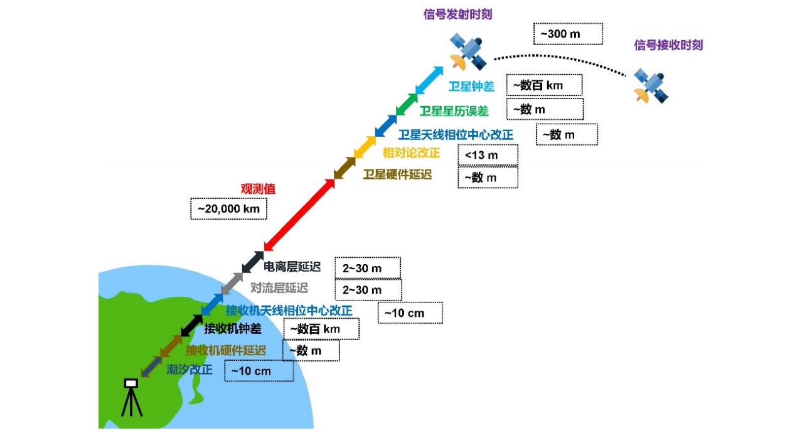
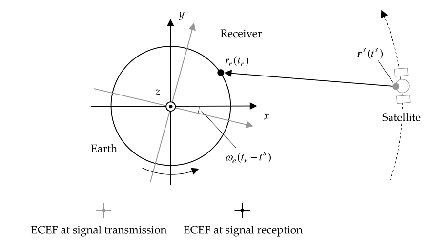
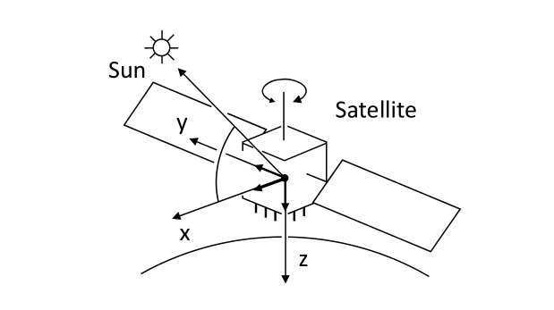
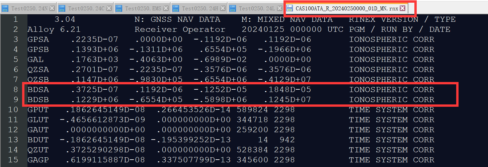
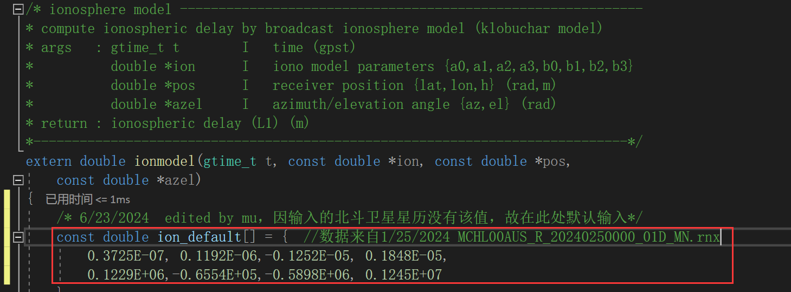
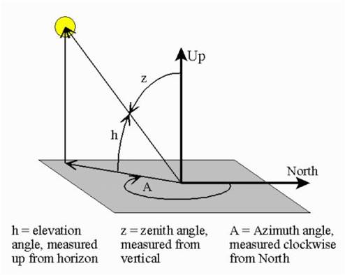

# 卫星定位误差模型



## 1. 地球旋转改正(Earth Rotation)

reference:[坐标变换图解](https://blog.csdn.net/weixin_45590473/article/details/122848202)

### 1.1坐标旋转矩阵


坐标逆时针旋转矩阵为
$$
\left[
\begin{matrix}
x^{\prime}	\\
y^{\prime}
\end{matrix}
\right]=

\left[
\begin{matrix}
cos\theta & sin\theta	\\
-sin\theta & cos\theta
\end{matrix}
\right]
\cdot

\left[
\begin{matrix}
x	\\
y
\end{matrix}
\right]	\\
\\
且

\left[
\begin{matrix}
cos\theta & sin\theta	\\
-sin\theta & cos\theta
\end{matrix}
\right]
\cdot

\left[
\begin{matrix}
cos\theta & -sin\theta	\\
sin\theta & cos\theta
\end{matrix}
\right]=

\left[
\begin{matrix}
1 & 0	\\
0 & 1
\end{matrix}
\right]	\\ \\
即
\left[
\begin{matrix}
x	\\
y
\end{matrix}
\right]=

\left[
\begin{matrix}
cos\theta & -sin\theta	\\
sin\theta & cos\theta
\end{matrix}
\right]
\cdot

\left[
\begin{matrix}
x^{\prime}	\\
y^{\prime}
\end{matrix}
\right]
$$

### 1.2 代码

#### 1 sp3插值

**地球旋转矩阵**即将上述坐标旋转矩阵扩展为3维，设卫星信号发射时间***t1***，此时卫星ECEF坐标***(x1,y1,z1)***到达接收机时间***t2***，此时卫星ECEF坐标***(x2,y2,z2)***，地球**逆时针**旋转，设***α=ω（t2-t1）***(*ω*为地球旋转角速度*rad\s*)，其旋转矩阵为
$$
\left[
\begin{matrix}
x2	\\
y2	\\
z2
\end{matrix}
\right]=	

\left[
\begin{matrix}
cos\alpha & sin\alpha & 0	\\
-sin\alpha & cos\alpha & 0	\\
0 & 0 & 1
\end{matrix}
\right]
\cdot

\left[
\begin{matrix}
x1	\\
y1	\\
z1
\end{matrix}
\right]
$$

在需要获得信号发射时间*(time)*的卫星位置时，需要在轨道弧上进行插值，而sp3文件中各个历元的卫星坐标以**该时刻ECEF**为基准，因此需要将轨道弧的不同历元ECEF**改正**到***time*时刻的*ECEF***

```c
/*代码片段来自preceph.c->pephpos()-----------------------------------------------------*/
for (j=0;j<=NMAX;j++) {
        t[j]=timediff(nav->peph[i+j].time,time);	//t[j]存储(轨道弧历元-卫星信号发送时间)
        if (norm(nav->peph[i+j].pos[sat-1],3)<=0.0) {
            trace(3,"prec ephem outage %s sat=%2d\n",time_str(time,0),sat); 
            return 0;
        }
    }
    for (j=0;j<=NMAX;j++) {
        pos=nav->peph[i+j].pos[sat-1];
        /* correciton for earh rotation ver.2.4.0 */
		//将各个历元某卫星ECEF坐标改正到观测时刻,旋转矩阵为顺时针旋转，卫星绕地球逆时针旋转
        sinl=sin(OMGE*t[j]);	//sin(弧度)返回-1~1之间的数
        cosl=cos(OMGE*t[j]);
        p[0][j]=cosl*pos[0]-sinl*pos[1];
        p[1][j]=sinl*pos[0]+cosl*pos[1];
        p[2][j]=pos[2];
    }
```

#### 2 计算卫地距离

卫星位置以卫星信号发射时间($t^s$)时的ECEF为基准，而接收机是$t_r$时刻接收到信号，此时地球在逆时针旋转，信号路径延长。所以我们可以将卫星坐标的ECEF从$t^s$改正到$t_s$时刻然后进行计算或者使用公式*Sagnac Effect*(*RTKLIB*使用此公式)
$$
\rho ^s_r\approx||r_r(t_r)-R_z(\omega_e\rho^s_r/c)r^s(t^s)||	\\
或：\rho ^s_r\approx||r_r(t_r)-R_z(\omega_e(t_r-t^s))r^s(t^s)||	\\
Sagnac:\rho ^s_r\approx||r_r(t_r)-r^s(t^s))+\frac{\omega_e}{c}(x^sy_r-y^sx_r)||
$$


```c
/* 代码片段来自rtkcmn.c->geodist()函数*/
/* geometric distance ----------------------------------------------------------
* compute geometric distance and receiver-to-satellite unit vector
* args   : double *rs       I   satellilte position (ecef at transmission) (m)
*          double *rr       I   receiver position (ecef at reception) (m)
*          double *e        O   line-of-sight vector (ecef)接收机指向卫星的单位向量
* return : geometric distance (m) (0>:error/no satellite position)
* notes  : distance includes sagnac effect correction
*-----------------------------------------------------------------------------*/
extern double geodist(const double *rs, const double *rr, double *e)
{
    double r;
    int i;
    
    if (norm(rs,3)<RE_WGS84) return -1.0;	//卫星到地心距离小于地球长半轴
    for (i=0;i<3;i++) e[i]=rs[i]-rr[i];
    r=norm(e,3);	//r为接收机到卫星距离
    for (i=0;i<3;i++) e[i]/=r;
    return r+OMGE*(rs[0]*rr[1]-rs[1]*rr[0])/CLIGHT;	//查询这个sagnac effect
}
```


## 2. 天线相位改正

### 2.1 卫星PCO改正

#### 星固坐标系

* Z轴指向地心

* Y轴太阳能板的旋转轴
  $$
  (因为太阳能板要一直面朝太阳获得能量\vec{sun}，而卫星要绕地球转动\vec{Z})，所以\vec{Y}=\vec{Z}\times\vec{Sun}
  $$

* X轴完善右手坐标系
  $$
  即\vec{X}=\vec{Y}\times\vec{Z}
  $$

*note*:根据上述坐标系可以看出*YZ*坐标轴构成一个平面，*X*为垂直这个平面的法向量，***Sun***向量和***X***在同一平面，该平面垂直***YZ***平面



#### 公式

根据antex14说明文件：
$$
\text{phase center position}=\text{CM(center of mass)}+\text{PCO(phase center offset vector)}	\\
note:\text{CM为ECEF坐标系下坐标，PCO为星固(satellite-fixed)坐标系下坐标}	\\
$$

星固坐标系在*ECEF*中的单位矢量
$$
X_{phase}=X_{mass}+
\left[
\begin{matrix}
e_x^s & e_y^s & e_z^s
\end{matrix}
\right]^{-1}X_{PCO}	\\
note:e_x^s,e_y^s,e_z^s为星固坐标系在ECEF中的单位矢量	\\
X_{PCV}=
\begin{bmatrix}
e_x^s & e_y^s & e_z^s
\end{bmatrix}^{-1}X_{PCO}	\\
$$

$$
e_z^s=-\frac{r^s}{|r^s|}(z\text{轴单位矢量}——r^s\text{为卫星在ECEF中的坐标})	\\
e_{sun}=\frac{r_{sun}-r^s}{|r_{sun}-r^s|}(\vec{sun}单位矢量——r_{sun}\text{为太阳在ECEF中的坐标})	\\
e_y^s=\frac{e_z^s\times e_s}{|e_z^s\times e_s|}(y\text{轴单位矢量})	\\
e_x^s=e_y^s\times e_z^s(x\text{轴单位矢量})	\\
$$

$$
\begin{equation}
\begin{aligned}
X_{PCV}&=
\begin{bmatrix}
e_x^s & e_y^s & e_z^s
\end{bmatrix}^{-1}X_{PCO}	\\
e_z^s&=-\frac{r^s}{|r^s|}	\\
e_s&=\frac{r_{sun}-r^s}{|r_{sun}-r^s|}	\\
e_y^s&=\frac{e_z^s\times e_s}{|e_z^s\times e_s|}	\\
e_x^s&=e_y^s\times e_z^s	\\
\end{aligned}
\end{equation}
$$


待补充：计算太阳坐标在eci坐标系中的公式；

eci->ECEF公式

#### PCO改正(*preceph.c->satantoff()函数*)

1. 计算太阳在eci坐标下的位置（***rtkcmn.c->sunmoonpos_eci()函数***）
2. 将eci坐标转换为ECEF坐标（***rtkcmn.c->eci2ecef()函数***）
3. 将PCO值从satellite-fixed坐标改正到ECEF[三维坐标转换](###1.3 三维坐标转换)
4. RTKLIB中，作者同时对PCO进行了**无电离层组合**处理，存入dant[4]中

```c
/* 代码片段来自preceph.c->satantoff()------------------------------------*/
/* 无电离层组合系数--------------------------------*/
C1= SQR(freq[0])/(SQR(freq[0])-SQR(freq[1]));	
C2=-SQR(freq[1])/(SQR(freq[0])-SQR(freq[1]));

/* iono-free LC(Linear Cobination) 无电离层线性组合*/
for (i=0;i<3;i++) {
    dant1=pcv->off[0][0]*ex[i]+pcv->off[0][1]*ey[i]+pcv->off[0][2]*ez[i];	//PCO改正到ECEF
    dant2=pcv->off[1][0]*ex[i]+pcv->off[1][1]*ey[i]+pcv->off[1][2]*ez[i];
    dant[i]=C1*dant1+C2*dant2;
}
```

5. 卫星的位置加上dant[]，获得卫星phase center position

```c
for (i=0;i<3;i++) {
        rs[i  ]=rss[i]+dant[i];
        rs[i+3]=(rst[i]-rss[i])/tt;	//获得卫星速度
    }
```

## 3. 相对论效应(relavisitic effect)

参考[多模GNSS融合精密单点定位理论与方法-蔡昌盛]()

这是由于卫星钟和接收机所处的状态(运动速度和重力位)不同引起的卫星钟和接收机钟之间的相对误差。由于卫星钟和地面钟存在相对运动，相对于地面钟，卫星钟走得慢，这会影响电磁波传播时间的测定

#### 3.1 狭义相对论影响

根据狭义相对论理论,安置在高速运动卫星里的卫星钟的频率将发生变化,使得GNSS卫星钟相对于接收机钟产生的频率偏差为(徐绍铨等,2003)
$$
\Delta f_1=-0.835\times10^{-10}f	\\
f为卫星钟的标准频率
$$

#### 3.2 广义相对论影响

按广义相对论理论,由于卫星所处的重力位与地面测站处的重力位不同导致同一台钟放在GNSS卫星上和放在地面上的频率将相差：
$$
\Delta f_2=5.284\times10^{-10}f
$$

#### 3.3 消除相对论

广义相对论影响比狭义相对论影响大，总体相对论效应的影响为：
$$
\Delta f=\Delta f_1+f_2=4.449\times10^{-10}F
$$
解决相对论的方法是在制造卫星钟时预先把频率减少$4.449\times10^{-10}f$。以*GPS*卫星为例，*GPS*卫星钟的标准频率为*10.23MHz*，所以厂家在生产时把频率降为
$$
10.23MHz\times(1-4.449\times10^{-10})=10.2999999545MHz
$$
这样卫星钟在进入卫星轨道后,受到相对论效应的影响而使频率正好变为标准频率。

$$
\Delta t_\mathrm{r}=-\frac{2RV}{c^2}
$$


#### 3.4 周期性相对论(preceph.c->peph2pos())

上述的讨论是假设卫星在**圆形轨道**中做**匀速运动**情况下进行的,而实际上卫星轨道是一个**椭圆**，卫星的运动**速度**也随时发生**变化**，相对论效应的影响并非常数,因而经上述改正后仍不可避免地含有残差,它对GPS的影响最大可达70ns。由**轨道偏心率**产生的**周期性**部分,可用如下公式进行改正：
$$
\Delta t_r=-\frac{2RV}{c^2}	\\
R和V分别代表卫星的位置向量和速度向量,c为光速
$$

```c
/* 代码片段来自preceph.c->peph2pos()，在插值获得发送信号时刻的卫星位置和速度后，就可以由上式获得相对论钟差---------*/
/* relativistic effect correction 钟差相对论效应---------*/
    if (dtss[0]!=0.0) {	//插值获得的钟差不为0
        dts[0]=dtss[0]-2.0*dot(rs,rs+3,3)/CLIGHT/CLIGHT;	//去除相对论钟差
        dts[1]=(dtst[0]-dtss[0])/tt;	//频漂
    }
```

## 4. 硬件延迟(DCB/TGD)

reference：[GNSS TGD /DCB改正模型](https://blog.csdn.net/weixin_44021189/article/details/128736089)

先对P1和P2加上DCB（从.dcb文件获得），然后根据是否是无电离层组合(IFLC):1、如果是无电离层，则返回无电离层组合观测值，且方差=0；2、如果是单频，则调用gettgd()函数获得tgd误差，且方差=0.09（***SQR(ERR_CBIAS)***作者预定义）

```c
/* 代码片段来自pntpos.c->prange()函数-------------------*/

```

[BDS星历中TGD的理解-CSDN博客](https://blog.csdn.net/weixin_44245500/article/details/135020434#:~:text=TGD (Timing Group Dealy)即卫星群延迟时间参数，它表征,的是卫星不同频率信号通道之间的延迟误 差，正是由于通道延迟偏差的存在，导致不同卫星信号在离开卫星发射天线的时间是不 同的，所以对于不同频率的信号，在进行卫 星钟差改正理论上也不尽相同。)

## 5. 相位缠绕

$$
\begin{aligned}
\widetilde\phi &=\operatorname{sign}(k\bullet(\overline{D}D))\operatorname{arccos}(D\bullet\overline{D}/(|D| |\overline{D}|)) \\
D &=x-k(k\bullet x)-ky \\
\overline{D} &=\overline{x}-k(k\bullet\overline{x})+k\overline{y}	\\
\Delta\phi &=2\pi\cdot\text{ROUND}(\frac{\Delta\phi_{\mathrm{prev}}-\bar{\phi}}{2\pi})+\bar{\phi}	\\
\end{aligned}
$$

## 6. 对流层延迟

$$
\Delta d_\mathrm{trop}=\Delta d_\mathrm{dry}m_\mathrm{dry}+\Delta d_\mathrm{wet}m_\mathrm{wet}
$$

## 7. 电离层改正

### 7.1 基础

参考：[新手小白关于导航电文中北斗系统电离层延迟改正的播发参数的疑问_电离层的8个校正参数-CSDN博客](https://blog.csdn.net/Ironmiyi/article/details/134966782)

* 北斗三代系统的电离层模型是BDGIM模型，其播发参数有9个。

* 而GPS系统和北斗二代系统的klobuchar模型播发参数为8个。

### 7.2 数据

[Rinex3 广播星历下载](https://cddis.nasa.gov/archive/gnss/data/daily/)   （需要翻墙）

到该目录下后，找到对应年份-->年积日-->**24p**文件下，里面是混合卫星系统的卫星星历文件，经实验，CAS1测站有北斗的电离层改正参数



### 7.3 RTKLIB klobuchar模型

因为实验的北斗电离层改正参数空缺，故在***rtkcmn.c->ionmodel()***函数内默认输入找到的电离层参数



## 8. 卫星高度角掩膜

* 方位角和高度角关系
  1. 方位角值范围：0-360°，高度角范围0~90°
  2. 计算时要先从大地坐标系转到ENU坐标系下求取
  3. 方位角通过东和北方向的反正切求取
  4. 高度角通过北方向的反正弦求取
  5. 具体代码见**rtkcmn.c->satzael()**函数
  6. 一般会设置最小的高度角，把低于这个高度角阈值的卫星剔除



