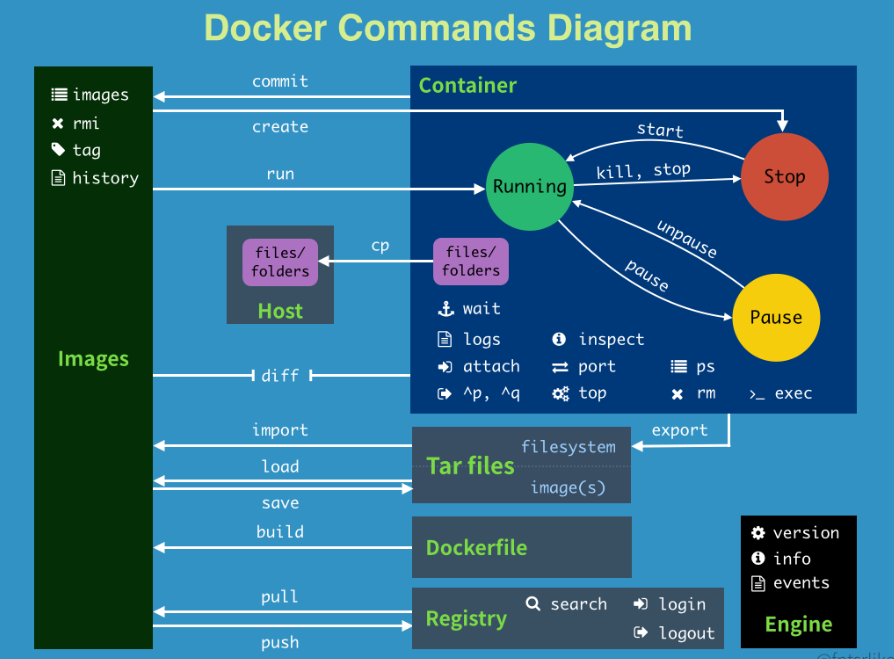

# Docker engine在SLAM中的应用

环境准备：除了安装**Docker engine**外，此容器还需要GPU支持，因此还需要安装[**NVIDIA Container Toolkit**](https://docs.nvidia.com/datacenter/cloud-native/container-toolkit/latest/install-guide.html#id1)

## 1 常用命令

```shell
# 显示docker的系统信息，包括容器镜像和容器的数量，后一个是命令帮助查询
docker info
docker 命令 --help

# 镜像相关命令
docker images
docker image inspect 镜像名:TAG / 镜像Id
docker search 镜像名
docker pull 镜像名:[tag]
docker rmi 镜像名:TAG / 镜像Id

# 容器相关命令
docker run [--name="Name" -d -it -p ] 镜像名 [-it参数对应的/bin/bash] [-c "传入容器的脚本"]
# 注:进入容器后，exit退出并停止容器，ctrl+p+q 退出不停止容器
# docker run -d centos 并不能后台启动，实际仍然需要加入-it给一个前台进程
docker ps -a
docker rm 容器id f
docker start 容器id
docker restart 容器id
docker stop 容器id
docker kill 容器id
docker exec -it 容器id /bin/bash

docker logs -tf --tail 10 容器id

# 主机和容器之间的数据
docker cp 容器id:容器内路径 主机目标路径  (在主机的命令行执行，容器可以不运行)
## 本地目录挂载到Docker （数据卷volume：目录的挂载）
## 匿名挂载，不指定本地目录
docker run -it -v /home/test（本地目录）：/home(容器内的目录) centos /bin/bash
## 具名挂载，注意juming-nginx是卷名，不是个目录，后一行是权限设置
docker run -d --name nginx02 -v juming-nginx:/etc/nginx nginx
## ro，即在容器内只读，宿主机才能改变权限
docker run -d --name nginx02 -v juming-nginx:/etc/nginx:ro nginx
## 匿名挂载的卷是个乱码，而具名挂载显示的是卷名，通过inspect查看本机内默认挂载目录
docker volume ls
docker volume inspect juming-nginx
## 容器共享数据卷
docker run -it --name centos1 -v volume01 centos:8 /bin/bash
docker run -it --name centos2 --volumes-from centos1 centos:8

# 在基础镜像上打包自己的镜像
docker commit -m="描述信息" -a="作者" 容器id 目标镜像名:[TAG]

```





## 2 构建容器流程

```shell
# 根据Dockerfile构建镜像
docker build -f dockerfile1 -t [仓库名][镜像名][:TAG] .
```

### 2.1 Dockerfile

先构建VINS-Fusion环境的镜像，根据下面的Dockerfile生成(对应**docker build ...**这一步骤)

```Dockerfile
FROM    osrf/ros:noetic-desktop-full

# ceres-solver（安装完清理源码，减小镜像大小）
COPY    ceres-solver-2.0.0.tar.gz /root
RUN     apt-get update && \
        apt-get install -y libatlas-base-dev libeigen3-dev libsuitesparse-dev libgoogle-glog-dev && \
        rm -rf /var/lib/apt/lists/* && \
        cd /root && \
        tar -xf ceres-solver-2.0.0.tar.gz && \
        cd ceres-solver-2.0.0 && \
        mkdir build && cd build && \
        cmake -DCMAKE_BUILD_TYPE=Release -DBUILD_SHARED_LIBS=true -DBUILD_TESTING=false -DBUILD_EXAMPLES=false .. && \
        make install -j15 && \
        rm -rf /root/ceres-solver-2.0.0   

RUN     mkdir -p /root/VINS_ws/src

WORKDIR /root/VINS_ws
```

### 2.2 devcontainer.json

其后，把从github拉取的源代码文件通过vscode打开，在vscode中，需要配置.devcontainer/devcontainer.json文件(实际就是执行**docker run ...**这一步骤的参数：挂载的目录，vscode的extensions等)

```json
{
    "name": "VINS-Fusion Dev",
    "image": "vins:1.0",
    "workspaceFolder": "/root/VINS_ws",
    "runArgs": [
        "--gpus",
        "all",
        "-e",
        "DISPLAY=:0",
        "--name",
        "vins-fusion-dev2",
        "--net=host"
    ],
    "mounts": [
        {
            "source": "${localWorkspaceFolder}/VINS-Fusion",
            "target": "/root/VINS_ws/src/VINS-Fusion",
            "type": "bind",
            "consistency": "cached"
        },
        {
            "source": "${localWorkspaceFolder}/.vscode",
            "target": "/root/VINS_ws/.vscode",
            "type": "bind",
            "consistency": "cached"
        },
        {
            "source": "/tmp/.X11-unix",
            "target": "/tmp/.X11-unix",
            "type": "bind"
        },
        {
            "source": "${env:HOME}/code/data",
            "target": "/root/data",
            "type": "bind"
        }
    ],
    "customizations": {
        "vscode": {
            "extensions": [
                "ms-vscode.cpptools-extension-pack",
                "jeff-hykin.better-cpp-syntax",
                "ms-python.python",
                "ms-python.vscode-pylance",
                "redhat.vscode-xml",
                "mutantdino.resourcemonitor",
                "redhat.vscode-yaml",
                "ms-iot.vscode-ros",
                "gruntfuggly.todo-tree"
            ]
        }
    }
}
```


## 3 ORB-SLAM3容器


## 4 docker 运行相关问题

> 1. 国内docker 镜像拉取问题

有两种办法：

1. 编辑Docker配置文件，指定国内镜像源的URL
2. 修改Docker 的代理接口，让其能使用我们电脑上的翻墙软件

第一种办法可直接上网搜索，这里介绍第二种，我使用的是Clash软件，端口是7890，执行下面的命令

```shell
sudo mkdir -p /etc/systemd/system/docker.service.d
sudo nano /etc/systemd/system/docker.service.d/http-proxy.conf

[Service]
Environment="HTTP_PROXY=http://127.0.0.1:7897"
Environment="HTTPS_PROXY=http://127.0.0.1:7897"
Environment="NO_PROXY=localhost,127.0.0.1,.local"

sudo systemctl daemon-reload
sudo systemctl restart docker

# 测试
sudo docker run hello-world
```


> 2. **xhost +**

在容器中运行rqt命令时，报错如下时，需要在本机上执行**xhost +**命令

```shell
No protocol specified
could not connect to display :0
This application failed to start because no Qt platform plugin could be initialized. Reinstalling the application may fix this problem.

Available platform plugins are: eglfs, linuxfb, minimal, minimalegl, offscreen, vnc, xcb.
```

> 3. --net=host

想要让容器也可以使用网络，因此在docker run时加入了--net=host参数，发现其占用内存多了2倍，系统非常卡顿，因此最好还是不加上该参数


## 参考

视频：[B站up 遇见狂神说]( https://www.bilibili.com/video/BV1og4y1q7M4/?p=9&share_source=copy_web&vd_source=3557345a623a156ed106b939e54ff1ec)

[Docker官网命令参考文档](https://docs.docker.com/reference/cli/docker/)

[Dockerfile官方参考网站](https://docs.docker.com/reference/dockerfile/)

[武汉大学导航中心唐海亮博士](https://github.com/thlsealight)