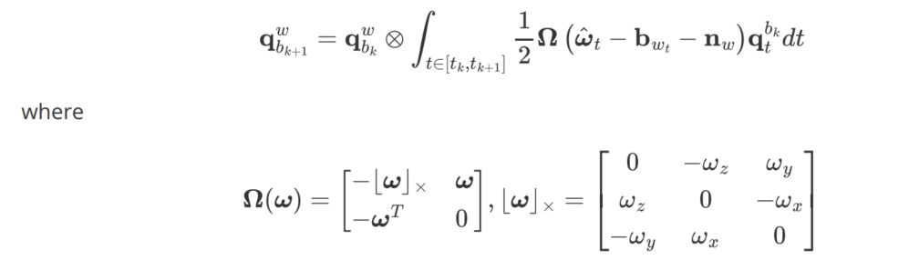
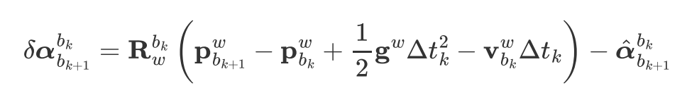

# 视觉SLAM疑难

## 1.重投影误差使用的是像素平面

答：在张正友标定法中 通过最小化重投影误差来优化相机标定参数，而在镜头处发生径向畸变，切向畸变忽略。描述该重投影误差获得的过程：世界坐标系旋转到相机坐标系后，再归一化，通过一个畸变多项式(k1,k2,k3)获得畸变后的坐标，内参矩阵与该坐标相乘获得相机参数模型预测得到的像素坐标，与实际获得的像素坐标之差就是重投影误差。该段代码实现参考 [ opencalib ](https://github.com/PJLab-ADG/SensorsCalibration/blob/master/lidar2camera/joint_calib/include/reprojection_error.hpp)

因此回答该问题，重投影实际用的还是像素平面，不理解为什么这里说是归一化平面
有个问题，VINS-mono中是怎么通过像素坐标去畸变得到归一化坐标的？

## 2. LK光流的三个假设

可以参考SLAM十四讲，上面讲的很详细
由于光流追踪，因此特征点会被滑窗中连续帧观测到（我以前一直以为特征点可以在下一帧不被观测到，在下下一帧又被观测到，但实际上在下下一帧已经是另一个特征点了）

## 3. 优化算法

https://blog.csdn.net/qq_42138662/article/details/109289129   这篇文章内容必须得掌握

## 4. 基础矩阵如何剔除外点

答：在计算基础矩阵时使用了RANSAC算法，因此可以剔除outliers

在这一部分要清楚什么是本质矩阵(essential)—

基础矩阵(fundamental)———5个自由度，但是实际计算会用到至少8个点(只考虑**尺度等价性**)，一对像素匹配点只能列一个方程；基础矩阵是奇异的，所以才能进行SVD分解，秩为2(因为其有一个左右的零空间，即极点)


## 5. 单应矩阵和基础矩阵

> 本节内容与图像拼接(image stitching)有关
>
> 此节内容请看书第十章内容，等15号以后仔细理一下
>
> 理清这三个矩阵的自由度，为什么基础矩阵7个点，8个点都可以解方程，基础矩阵的左右零空间什么意思

下图是齐次坐标图示，不过我也用来理解归一化，也就是说随着Z轴数值的变化，其点的位置始终在黄色轴上


单应矩阵(homography)——描述一个平面通过一个点投影到另一个平面，这个过程叫投影变换/平面透视(projective transformation/planer perspective)(也就是针孔相机模型)，是从仿射变换扩展而来(见十四讲P3.5)。**H矩阵**应该是特指2D的仿射变换，有8个自由度，一对匹配点可以列2个方程，因此至少需要4对点

针孔相机模型就是一个投影变换所以两条世界坐标系中的平行线会相交于消失点


## 6. 退化

特征点共面或相机发生纯旋转？SLAM十四讲P172提到了这一点

## 7.归一化平面

归一化平面位于Z=1的位置，像平面位于Z=f的位置（这里要理解下比如为什么规定的是像平面的共视差(单位像素)，在使用时，需要除以固定焦距，得到的共视差就可以作为关键帧视差判断的阈值——补充：计算关键帧视差是在归一化平面上）

在追踪特征点时，计算前后帧特征点的速度，实际计算的是去畸变后归一化平面的速度

个人认为为什么要用归一化平面呢？因为像素平面的坐标是存在径向和切向畸变的，不能反映世界地标中的关系；同时相机又是缺乏深度信息的，所以归一化平面是最合适且统一的

## 8 IMU积分和预积分

* IMU积分用来描述连续时间下PVQ的状态变化
  * 如上图所示，加速度的两次积分描述位置的变化，加速度一次积分描述速度的变化，角速度一次积分描述姿态的变化
  * 在**滤波**中，IMU用来做预测，视觉用来做观测，因此IMU在滤波中主要是通过积分来预测位姿和速度





-----

* IMU预积分
  * 优化中，IMU作为帧间约束
  * 下面的α，β，γ就是预积分量，也有人把α，β，γ当作P,V,Q，但这不是完全正确的
  * **难点**：预积分量代入的是观测值，耦合了重力加速度，算出来的速度α和位移β也受到重力的影响
    与帧间匹配获得的PV意义不一样，但是γ算出来的位姿是正确的，VINS-mono中还通过两个来源的q算外参
  
  


## 9 Jacobian和离散形式的误差运动方程

$$
f(x+\Delta x)=f(x)+J_{(x)}\Delta x
$$

预积分零偏建模方式,下式$J_{(k+1)}$是对k+1时刻的自身状态求导(pvq状态+加速度和陀螺仪零偏)
$$
\begin{align*}
F(x_{k+1}+\Delta x) &=F(x_{k+1})+J_{(k+1)}\Delta x	\\
J_{(k+1)} &= \frac{\sigma{x_{k+1}}}{\sigma{x}}	\\
J_{(k)} &= \frac{\sigma{x_{k}}}{\sigma{x}}	\\
而\Delta x_{k+1} &=F\Delta x_k+Gn即F=\frac{\sigma x_{k+1}}{\sigma x_k}	\\
\therefore J_{(k+1)} &=F \cdot J_{(k)}
\end{align*}
$$

## 10 相机和IMU外参标定的过程

也叫手眼标定的过程，参考initial_ex_rotation.cpp里面的`InitialEXRotation::CalibrationExRotation（）`代码和VINSmono文档，主要的考点是外参是由一个预积分量和两帧间的对极几何求出的R,T获得的[13 对极几何由本质矩阵提出R,T的过程](## 13 对极几何由本质矩阵提出R,T的过程)，然后构建了一个AX=0的方程，x就是外参(四个参数)，A通过SVD分解得知要使x最小，x等于V矩阵的最后一列

## 11 IMU可观性分析

`bool Estimator::initialStructure()`这段代码前面段落介绍了IMU能观性，首先取出IMU的一个速度预积分量，除以一个预积分量的时间，得到一个加速度。统计滑窗中若干个预积分量的加速度的一个方差，如果这个方差<0.25，说明IMU的运动激励不够。值得注意的是，作者没有启用这个功能，可能<0.25时对能观性不影响？

## 12 视差计算

一般的问题是求解两帧之间的视差，首先两帧之间肯定有共视点，并且获得了共视点在两帧上的归一化坐标(该函数实现见`FeatureManager::getCorresponding()`函数)，VINS-mono中共视计算是求两个归一化坐标的距离(向量的二范数，即Eigen 的norm())，把所有共视点距离求和，再除以共视点的数目得到一个平均视差，不过这个平均视差是在归一化坐标，在VINS-mono中把平均视差乘以焦距才是两帧之间视差的量化（参考`Estimator::relativePose()`）


VINS-mobo判断的是次新帧是否是关键帧，比如输入`FeatureManager::compensatedParallax2()`是最新帧，其计算的是最新帧的前两帧的视差，也就是判断次新帧是否是关键帧


## 13 对极几何由本质矩阵提出R,T的过程

参考代码：`Estimator::relativePose()-->` `MotionEstimator::solveRelativeRT()`

`initial_ex_rotation.cpp``InitialEXRotatino::testTriangulation()`函数手写代码实现

原理：已知特征点在两帧图像的归一化坐标，可列出基础矩阵的约束方程，通过`cv::findFundamentalMat()`得到基础矩阵，然后`cv::recoverPose()`把基础矩阵分解可得到R,T


详细可参考十四讲

* 注意，这里求得的T的**尺度**未知，原因：

$$
\left[\begin{array}{c}
x_r & y_r & z_r
\end{array}\right]
E_{3x3}
\left[\begin{array}{c}
x_l \\
y_l \\
z_l
\end{array}\right]=0	\\
E_{3x3}=t_{rl}^{\wedge}R_{rl}
$$

如上原理所示，因为我们使用的是归一化坐标，也就是左右要除以$z_r$和$z_l$，同时这也证明了本质矩阵的尺度等价性，同时除了上述形式，还要注意**八点法**求解本质矩阵

* 注意：cv接口求解的R，T是把前一帧($l$)转到后一帧$r$

## 14 三角化/求解空间点深度过程

代码参考`GlobalSFM::triangulatePoint（）`参考`GlobalSFM::triangulateTwoFrames()`——>`GlobalSFM::triangulatePoint()`   这里三角化过程只代入了特征点的两帧观测帧

`FeatureManager::triangulate()`也实现了该过程，主要目的是求解空间点深度。对于一个地图点，其被滑窗中若干个关键帧观测到，那么我们需要把第一个关键帧作为世界坐标系原点，通过下面的投影约束方程，解得该特征点在第一个关键帧下的世界坐标，准确说是深度（世界坐标系的z值）。	

* **note**:代码里有一点需要注意，代码里在代入[u,v,1]前先进行了归一化，GPT解释是保证方向信息不变的同时消除了尺度因素

* ```c++
  Eigen::Vector3d f = it_per_frame.point.normalized();
  svd_A.row(svd_idx++) = f[0] * P.row(2) - f[2] * P.row(0);  
  svd_A.row(svd_idx++) = f[1] * P.row(2) - f[2] * P.row(1);
  ```

* 这里Ax=0代入的特征点的所有观测帧

  

先设一帧中一个特征点的坐标方程，设特征点的世界坐标为齐次向量，由于在投影到相机坐标系丢失了深度，才乘了一个系数***a***，把旋转和平移组成的增广矩阵拆成三个行向量。可以看出归一化坐标和右边的向量平行，因此这两个向量的叉乘等于0，最后构建了一个Ax=0的方程，该方程由4个约束，4个未知量构成，不是超定方程，但仍然可通过SVD求解
$$
\left[\begin{array}{c}
u \\
v \\
1
\end{array}\right]
=
a*\left[\begin{array}
\boldsymbol{R}_{cw} & \boldsymbol{t}_{cw}
\end{array}\right] *P_w 	\\
其中P_w=
\left[\begin{array}{c}
X \\
Y \\
Z	\\
1
\end{array}\right]
,\left[\begin{array}
\boldsymbol{R}_{cw} & \boldsymbol{t}_{cw}
\end{array}\right] =
\left[\begin{array}{c}
T_0 \\
T_1 \\
T_2
\end{array}\right]	\\
\therefore \left[\begin{array}{c}
u \\
v \\
1
\end{array}\right]
=a*
\left[\begin{array}{c}
T_0P_w \\
T_1P_w \\
T_2P_w
\end{array}\right]	\\
\therefore \left[\begin{array}{ccc}
i & j & k \\
u & v & 1 \\
T_0P_w & T_1P_w & T_2P_w
\end{array}\right]=
\left[\begin{array}{c}
0 \\
0 \\
0
\end{array}\right]	\\
\therefore \left\{
\begin{aligned}
vT_2P_w-T_1P_w &= 0 \\
uT_2P_w-T_0P_w &= 0  \\
uT_1P_w-vT_0P_w &= 0
\end{aligned}
\right.	\\
第三行并无约束含义，因此前两个可组成约束方程	\\
\left[\begin{array}{c}
vT_2-T_1\\
uT_2-T_0\\
\end{array}\right]*
P_w=\vec{0}
$$

## 15 PnP 3D-2D求解相机位姿的过程

该部分代码可参考`GlobalSFM::solveFrameByPnP()`

PnP要求有至少三对(归一化坐标/像素坐标和世界坐标)才可以解当前相机位姿，实际VINS-mono中至少要15对，该PnP过程是调用`cv::solvePnP()`实现的，求得的是$T_{cw}$

查看其他开源代码看看具体如何实现pnp


## 17 陀螺仪零偏初始化

下面的角标要从右往左理解，在程序中，$T_{bc}$从camera转到body坐标系才是已求量
$$
\begin{align*}
验证sP_{c_0b_k}	&=sP_{c_0c_k}-R_{c_0b_k}P_{bc}	\\
T_{c_0c_k}	&=T_{c_0b_k} \cdot T_{bc}		\\
即\left[\begin{array}{ccc}
R_{c_0c_k} & sP_{c_0c_k} \\
0 & 1	 \\
\end{array}\right]
&=
\left[\begin{array}{ccc}
R_{c_0b_k} & sP_{c_0b_k} \\
0 & 1	 \\
\end{array}\right]
\left[\begin{array}{ccc}
R_{bc} & P_{bc} \\
0 & 1	 \\
\end{array}\right]
\end{align*}
$$

## 18 四元数和旋转矩阵乘法

* 该四元数读法是从右下读到右上
  四元数右乘实现坐标系旋转，而从字母顺序看，从左往右乘就可以实现坐标系统转换


而旋转矩阵表示的仅是坐标从一个坐标系到另一个坐标系


## Eigen 求解Ax=b的几种方法

https://www.cnblogs.com/feifanrensheng/articles/8510702.html

## 19 矩阵分块的最小二乘解法

原理
$$
A=\left[\begin{array}{l}
A_1 \\
A_2
\end{array}\right], \quad b=\left[\begin{array}{l}
b_1 \\
b_2
\end{array}\right]	\\
A_1 x=b_1, \quad A_2 x=b_2	\\
\left(A_1^T A_1+A_2^T A_2\right) x=A_1^T b_1+A_2^T b_2	\\
\sum_i A_i^T A_i \cdot x=\sum_i A_i^T b_i
$$
对于上面式子的简单应用可参见`initial_aligment.cpp solveGyroscopeBias()`

还有一种复杂应用参考`initial_aligment.cpp LinearAlignment()`
$$
\begin{align*}
X &=[\vec{v_0},\vec{v_1},...,\vec{v_n},\vec{g^{c_0}},s]^T	\\
实际每次只能列出A_{k_{6\times10}} 
\left[\begin{array}{l}
\vec{v_k} \\
\vec{v_{k+1}}	\\
\vec{g^{c_0}}	\\
s
\end{array}\right]
&=b_k	\\
A^{T}_k A_k拆成四个矩阵，然后再分别加到X的系数矩阵里

\end{align*}
$$

## 20 VINS-mono中常用坐标转换

在对一个滑窗中的枢纽帧的位姿设为(I,0)后，已知相机和IMU的旋转，平移外参
$$
\begin{align*}
T_{wc} \cdot T_{ic}^{-1}	&=T_{wi}（世界坐标系下IMU的平移）	\\
即
\left[\begin{array}{ccc}
R_{wc} & st_{wc} \\
0 & 1	 \\
\end{array}\right]
\left[\begin{array}{ccc}
R_{ic}^T & -R_{ic}^{T} \cdot t_{ic} \\
0 & 1	 \\
\end{array}\right]
&=
T_{wi}	\\
st_{wc}-R_{wc}R_{ic}^{T}t_{ic}=st_{wc}-R_{wi}t_{ic}
\end{align*}
$$

## 21 多线程调试


* 高翔说可以通过gtest进行单元测试
* 高翔的CSDN博客，半不闲居士（VINSmono是动态初始化，而高翔的一篇博客提到了OpenVINS是动态初始化，后面可以仔细看下）

## 22 关键帧判断

参考函数`FeatureManager::addFeatureCheckParallax()`

1. 滑窗中的前两帧为关键帧

2. 追踪的连续特征点过少（记住，这里不是总共的特征点，在VINS-mono中，是追踪的特征点在一个滑窗中list<FeaturePerId>中存在，才判断为连续的）
3. 该帧的前两帧视差过大，那么该帧就是关键帧

## 23 sfm过程

参考`Estimator::initialStructure()`——>`GlobalSFM::construct()`

* sfm定义

1. 在滑窗中选择一个枢纽帧(要注意枢纽帧选取规则)，其设为世界原点，通过对极几何计算枢纽帧和滑窗最后一帧的R,T(T尺度未知)（VINS-mono中维护的是Twc）
1. 首先通过三角化求枢纽帧和最后一帧共视的特征点世界坐标（三角化）
1. 首先根据已有枢纽帧位姿($l$)，通过pnp求解枢纽帧下一图像帧位姿($l+1$)，下一图像帧($l+1$)和最后一帧($frame_num$)再进行三角化，循环进行该过程，直到最后一帧
1. 考虑到有些特征点不能被最后一帧看到，也就不能被三角化，因此遍历从枢纽帧+1到最后一帧，都与枢纽帧进行三角化——(不过我觉得VINS-mono这里有bug：因为三角化平移应该尽可能大，那么应该从最后一帧到枢纽帧，都与枢纽帧进行三角化)
1. 通过已有的三角化点，pnp求解枢纽帧前一帧位姿，再三角化枢纽帧和枢纽帧前一帧共视的特征点，循环进行该过程，直到第一帧——（这里我同样觉得，应该循环从第一帧到枢纽帧，最开始应该先三角化第一帧和枢纽帧）
1. 至此得到了所有图像帧的位姿，遍历没有被三角化的特征点，取该特征点被观察到的首尾帧（要有足够的视差/平移才能三角化）位姿进行三角化——比如有些特征点从l+1被看到，到倒数第二帧不再被看到，这些点不能三角化
1. BA优化地图点和滑动窗口的位姿()

备忘：


## 24 视觉惯性对齐

1. 首先通过前面的单目SLAM，已经获得了各相机的位姿，通过外参可以得到一个旋转量$Q_{c_0b_k}$ 和缺少尺度的$T_{c_0c_k}$，根据相机计算出来的旋转（得通过外参转换到bk坐标系下）理论上是等于预积分出来的旋转(但实际会受到陀螺仪零偏影响)，那么据此列出一个Ax=b的方程，最后求得一个滑窗内的陀螺仪零偏

2. 通过位移预积分的定义，解一个Ax=b的方程，得到一个滑窗内各IMU预积分帧坐标系bk下 k帧IMU预积分的速度$v^{b_k}_{b_k}$，枢纽帧的重力方向$g^{c_0}$，以及尺度$s$

   

   **bk**下k帧IMU预积分速度转为**c0**下的公式：
   $$
   v^{c_0}_{b_k}=R^{c_0}_{b_k}*v^{b_k}_{b_k}
   $$
   
3. 初始化通过单目SLAM以获得$Q_{c_0b_k}$和$T_{c_0c_k}$，通过特征点的所有观测帧进行三角化求观测点深度[triangulate](##14 三角化/求解空间点深度过程) ，这个深度是该特征点在第一个关键帧下的世界坐标的Z值

$$
\begin{align*}
T_{c_{k_0}c_{k_1}} &=
T_{c_{0}c_{k_0}}^{-1}
\cdot
T_{c_{0}c_{k_1}}	\\
&=\left[\begin{array}{ccc}
R_{c_{0}c_{k_0}}^T & -R_{c_{0}c_{k_0}}^T \cdot t_{c_{0}c_{k_0}} \\
0 & 1	 \\
\end{array}\right]
\left[\begin{array}{ccc}
R_{c_{0}c_{k_1}} & t_{c_{0}c_{k_1}} \\
0 & 1	 \\
\end{array}\right]
\end{align*}
$$

根据上面这个式子把$T_{c_{k_0}}$作为世界坐标系列出Ax=0解得深度值，但是注意，因为用来求解的$T_{c_0c_k}$ **缺少尺度**，所以解得的深度值也是缺少尺度的(**真实的深度值**需要**乘以第二步获得的s**)

4. 计算预测的bk1帧相对bk0帧的平移（但是该平移的计算是以枢纽帧/世界坐标系为基准） 

公式转换如下，其中用到了外参的平移，说明输入的**tic需要尺度准确**的
$$
\begin{align*}
T_{c_0b_k} &=
T_{c_{0}c_{k}}
\cdot
T_{ic}^T	\\
&=\left[\begin{array}{ccc}
R_{c_{0}c_{k}} & s \cdot t_{c_{0}c_{k}} \\
0 & 1	 \\
\end{array}\right]
\left[\begin{array}{ccc}
R_{ic}^T & -R_{ic}^T \cdot t_{ic} \\
0 & 1	 \\
\end{array}\right]	\\	
T_{b_{k_0}b_{b_{k_1}}} &=
T_{c_0b_{b_{k_1}}}-T_{c_0b_{b_{k_0}}}
\end{align*}
$$

5. 获得枢纽帧c0到世界坐标系的旋转矩阵$R_{wb_{k_0}}$（且c0旋转后的世界坐标系x方向和bk0帧的x方向一样）已知：世界坐标系的z轴为[0,0,1]

过程：首先根据枢纽帧的重力方向$g^{c_0}$，要计算一个旋转矩阵$R_{wc_0}$把枢纽帧转到世界坐标系上(即$g^{c_0}$和[0,0,1]对齐)

把该$R_{wc_0}$的yaw角置0

然后$R_{wb_{k_0}}=R_{wc_0}*R_{c_0b_{k_0}}$，获得$R_{wb_{k_0}}$的yaw角，让旋转矩阵$R_{wc_0}$再乘以这个-yaw角就是我们需要的$R_{wc_0}$，这样最后世界坐标系x方向就和bk0帧的x方向一样

## 25 Ceres优化

参考Estimator::optimization()

1. **关于ceres的一些笔记**：
   1. 在优化时广义加法需要自己定义，ceres里面用的是double数组类型，可通过把double数组映射为Eigen::Map，借助Eigen对四元数乘法运算符的重载，实现广义加法(参考`PoseLocalParameterization::Plus()`)
   2. ceres可通过`proble.AddResidualBlock()`加入待优化的参数块；而对于需要自定义广义加法的参数块通过`problem.AddParameterBlock()`加入待优化的参数块；如果有些参数不需要优化（比如外参），可在加入参数块后设置`problem.SetParameterBlockConstant()`实现不优化某些参数块
   3. VINS-mono使用ceres 2.1及其以下版本，其使用`LocalParameterization`来定义广义加法，查询发现Ceres 2.2 使用`Manifold`替换了`LocalParameterization`，因此在使用时要注意版本问题


2. **优化的变量**是$P_s(T^w_{bk_0bk_i})$,$R_s(R_{wbk})$,$V_s(V_{wbk})$,Bas,Bgs,tic,ric,每个地图点的逆深度dep，(td)`，可在`Estimator::vector2double()`具体查看每个待优化变量的大小

**为什么VINS-mono优化的不是地图点的位置，而是其逆深度值？**解答：

1. 1. 如果直接优化地图点，相当于同时对 x,y,z三个变量进行优化，而单目系统中 z 的观测信息（约束）远弱于 x,y（像素平面的投影关系）。这种 不平衡的观测强度 会导致优化问题数值不稳定。
   2. 使用逆深度而不是深度是因为Hessian矩阵需要数值稳定性，改为逆深度那么其量级和xy方向量级一致
   3. 延迟初始化：单目SLAM中，新检测的特征点无法立即确定深度。逆深度允许将逆深度初始化为一个宽范围的高斯分布（如 ρ∼N(0,1)），后续通过观测逐步收敛。如果直接优化XYZ，初始深度误差会严重影响 x,y 的估计（因为三者耦合）。
   4. 逆深度支持无穷远点，因为无穷远点的逆深度趋近0，仍然可以参与优化


3. **优化因子的权阵(信息矩阵)**
   
   1. **预积分中协方差矩阵的作用**：协方差矩阵反应IMU预积分的噪声不确定性，协方差矩阵的逆是信息矩阵(information matrix)，信息矩阵反应状态的精度。
      $$
      r^{\top} \Sigma^{-1} r
      $$
      
   2. **重投影误差**的权阵和焦距有关：像素坐标的误差和焦距有关，焦距越大，像素坐标对特征点位置的敏感性越高;1.5是经验缩放因子，测量噪声的标准差
   
      其后续作为权阵乘在残差和jacobian矩阵上
   
   3. 在ceres自动求导时，需要构建残差，此时也需要加入信息矩阵，即**残差除以标准差**
      $$
      r_{i}=\frac{z_{i}-h\left(x_{i}\right)}{\sigma_{i}}
      $$
      


```c++
//sqrt_info是上三角矩阵(.matrixL()进行cholesky分解LL^T得到下三角矩阵，cholesky分解要求对称正定阵，协方差的逆天然满足)
Eigen::Matrix<double, 15, 15> sqrt_info = Eigen::LLT<Eigen::Matrix<double, 15, 15>>(pre_integration->covariance.inverse()).matrixL().transpose();

//重投影误差权阵
ProjectionFactor::sqrt_info = FOCAL_LENGTH / 1.5 * Matrix2d::Identity();
```


## 26 左扰动和右扰动

IMU预积分是局部系下的扰动，

之后根据旋转矩阵形式列出其是左扰动还是右扰动

VINSmono中是$R_{wc}$形式，且求导的参数要和优化参数一致，比如公式中是$R_{cw}$形式，求导时的操作如下


$$
\begin{align*}
\frac{\partial(\boldsymbol{R_{wc}} \boldsymbol{p})}{\partial \varphi}
&=\lim _{\varphi \rightarrow 0} \frac{
\exp \left(\boldsymbol{\phi}^{\wedge}\right)
\exp \left(\boldsymbol{\varphi}^{\wedge}\right) \boldsymbol{p}-\exp \left(\boldsymbol{\phi}^{\wedge}\right) \boldsymbol{p}}{\varphi}	\\
&=-R_{wc}p^{\wedge}
\end{align*}
$$
$$
\begin{align*}
\frac{\partial(\boldsymbol{\alpha _{b_{k+1}}^{b_k}})}{\partial \varphi_{wb_k}}
&=\lim _{\varphi \rightarrow 0} \frac{
(R^w_{b_k}
\exp \left(\boldsymbol{\varphi}^{\wedge}\right))^{-1}
\boldsymbol{p}-
(R^w_{b_k})^{-1}
\boldsymbol{p}}{\varphi}	\\
&=\frac{
(I-\boldsymbol{\varphi}^{\wedge})
R^{b_k}_w\boldsymbol{p}
-R^{b_k}_w\boldsymbol{p}}
{\varphi}	\\
&={[R^{b_k}_wp]}^{\wedge}
\end{align*}
$$


而十四讲中是$R_{cw}$形式，左扰动还是右扰动的**技巧**就是坐标转换的链式法则，局部系应该加在c坐标那边


四元数扰动

在求角度误差对k时刻角度误差的jacobian推导时会用到，方法同样是乘一个四元数的微小量


旋转差分

在求旋转的残差时会用到，准确来说是四元数差分转换为旋转向量

```c++
//x0是优化前参数块，x是优化后参数块
dx.segment<3>(idx + 3) = 2.0 *Eigen::Quaterniond(x0(6), x0(3), x0(4), x0(5).inverse() *Eigen::Quaterniond(x(6), x(3), x(4), x(5))).vec();
//且四元数实部w=cos(θ/2)，如果w>=0，则θ在[Π，-Π]之间，是旋转的最短路径，因此还要执行下面的判断
```


## 27 VIO四自由度不可观

* IMU可以测量重力方向(Roll和Pitch可观)【VINS-fusion在初始化时，假设第一帧IMU的加速度方向就是重力方向，第一帧IMUyaw设为0，由此初始化IMU姿态Rwbk0，参考Estimator::initFirstIMUPose()】，加速度计可恢复尺度，因此**VIO四自由度不可观**

这意味着优化问题的Hessian矩阵在这4个自由度上是奇异的，即优化无法唯一确定它们的值

* 如果不对这4个自由度进行约束，优化时会出现**零空间漂移**（即整个轨迹整体平移或yaw漂移）和Hessian矩阵在不可观维度上奇异导致的**求解无法收敛**
* **解决办法**：来源自deepseek，VINS-mono中采用固定第一帧位姿的方法


## 28 软同步和时间标定

foxglove 里的ros header stamp和log time(receive time)之间区别在哪里，是否软同步会让ros header stamp一样，但是那又为什么需要时间标定呢？


## 29 导航坐标系和IMU区别

VIO是基于IMU系发布的，IMU坐标系有前右下和前左上两种形式，


## VINS的其他可参考方案

[VIO开源总结](https://zhuanlan.zhihu.com/p/497942945)

[GVINS](https://github.com/HKUST-Aerial-Robotics/GVINS.git) GNSS和VIO紧耦合，港科大

VINS-fusion GNSS和VIO松耦合，ceres自动求导

## tools

foxglove

[ROS 1 | Foxglove Docs](https://docs.foxglove.dev/docs/connecting-to-data/frameworks/ros1#foxglove-websocket)

IMU：考虑比例因子误差和零偏，比力：**加速度和引力的叠加**


SLAM的**ZUPT**是什么？
$$
e^{VIO}_k
$$
vinsfusion学习双目的使用

之后再了解openvins里的MSCKF
